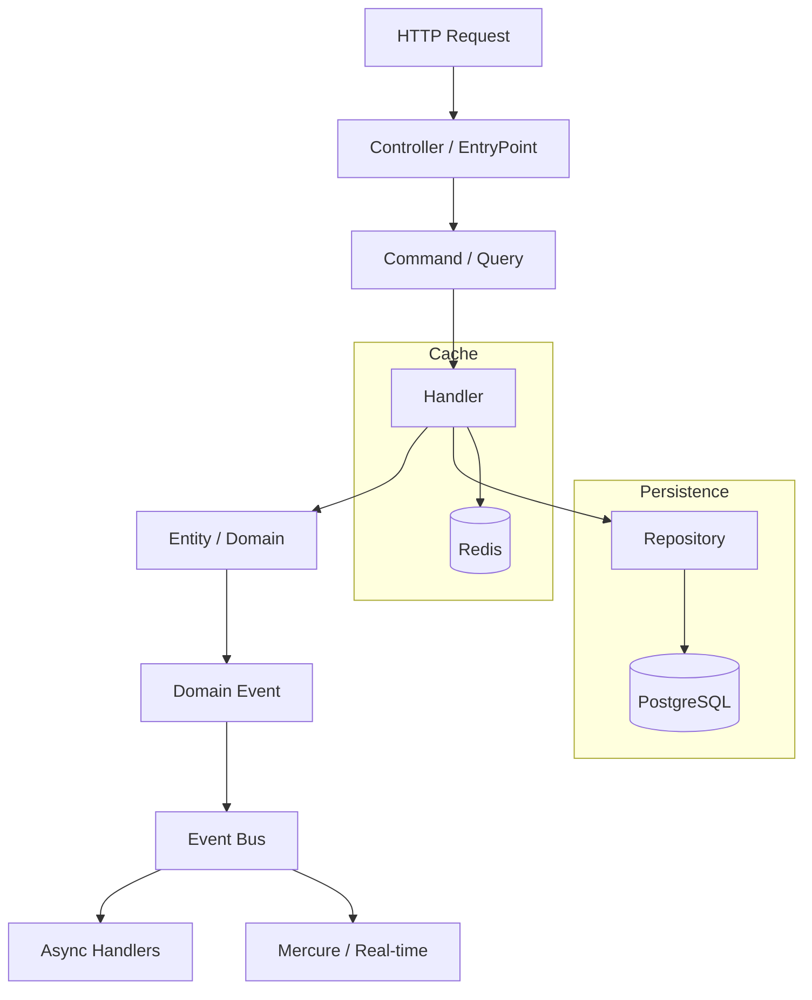

# 🚀 Pragmatic Franken

> **Why waste time on repetitive boilerplate?**
> Pragmatic Franken is a unified, production-ready foundation built on Symfony and FrankenPHP. Focus on logic, not configuration.

[](https://www.php.net/releases/8.5/)
[](https://frankenphp.dev/)
[](https://symfony.com/)
[](https://opensource.org/licenses/MIT)
[](https://github.com/k2gl/pragmatic-franken/actions)

---

## ⚡️ The "Vibe"

- **One Binary to Rule Them All**: No Nginx, no FPM. Just FrankenPHP.
- **Worker Mode by Default**: Insane performance (boot once, handle thousands of requests).
- **AI-Native**: Pre-configured contexts for Cursor, Windsurf, and Copilot.
- **Pragmatic Architecture**: Vertical Slices instead of messy layers.

---

## 🚀 Instant Start

```bash
# 1. Clone and ignite
git clone https://github.com && cd pragmatic-franken

# 2. The Magic Command
make install
```

**Boom!** Your app is live at https://localhost with automatic HTTPS.

---

## 🤖 AI-Driven Development

- **AGENTS.md** — The entry point for your AI.
- **prompts/check-docs.md** — Run this to sync your AI with our ADRs.
- **Local Vibe** — Custom tool paths in `.config/agents/agents.local.md`.

---

## 🏗 Pragmatic Stack

| Feature | Tech | Why? |
|---------|------|------|
| Runtime | FrankenPHP | 103 Early Hints, Mercure, and Go-speed. |
| Architecture | Vertical Slices | Features are isolated. High cohesion, low coupling. |
| Database | PostgreSQL 16 | Robust, modern, ready for scale. |
| Async | Messenger + Redis | Built-in CQRS for background heavy lifting. |

---

## 📐 The Pragmatic Way

How we write code:

1. Create a Feature Slice
2. Define a Command or Query
3. Handle it

**No over-engineering.**

---

## ⚡️ Worker Mode Rules

| Rule | Bad | Good |
|------|-----|------|
| No static cache | `static $cache = []` | `$this->cache->set()` |
| Stateless entities | Entity with static state | Pure entities |
| Clean shutdown | Implicit memory leaks | `register_shutdown_function()` |
| Avoid singletons | `Singleton::getInstance()` | Dependency Injection |

---

## 🛠 ADR: Architecture Decision Records

| ADR | Topic | Priority |
|-----|-------|----------|
| [0001](docs/adr/0001-vertical-slices.md) | Vertical Slices Architecture | P0 |
| [0002](docs/adr/0002-messenger-transport.md) | Messenger Transport (CQRS) | P0 |
| [0003](docs/adr/0003-pragmatic-symfony-architecture.md) | Pragmatic Symfony | P0 |
| [0004](docs/adr/0004-frankenphp-runtime.md) | FrankenPHP Runtime | P1 |
| [0005](docs/adr/0005-health-checks.md) | Health Checks | P1 |
| [0006](docs/adr/0006-memory-management.md) | Memory Management | P2 |
| [0007](docs/adr/0007-asset-mapper.md) | AssetMapper | P2 |

---

## 🔄 Deep Dive



**See [ADR 0002](docs/adr/0002-messenger-transport.md) for Message Bus implementation details.**

---

## 📁 Project Structure

```
pragmatic-franken/
├── src/
│   ├── Kernel.php              # Symfony MicroKernel
│   ├── User/                   # Module (Bounded Context)
│   │   ├── Entity/
│   │   ├── Enums/
│   │   └── Features/           # Vertical Slices
│   │       ├── RegisterUser/
│   │       │   ├── RegisterUserCommand.php
│   │       │   ├── RegisterUserHandler.php
│   │       │   ├── EntryPoint/Http/
│   │       │   │   └── RegisterUserController.php
│   │       │   ├── Request/
│   │       │   └── Response/
│   │       └── Events/
│   │           └── UserRegisteredEvent.php
│   └── Shared/                 # Cross-module kernel
│       ├── Exception/
│       └── Services/
├── docker/
│   ├── frankenphp/            # FrankenPHP + Caddy
│   └── php/                   # Extensions
├── docs/
│   ├── adr/                   # Architecture Decisions
│   └── guides/                 # How-to guides
├── tests/
│   ├── Unit/
│   ├── Integration/
│   └── EndToEnd/
├── Makefile
├── docker-compose.yml
└── prompts/                    # AI agent prompts
```

---

## 📚 Guides

- [Development Guide](docs/guides/development.md)
- [Testing Guide](docs/guides/testing.md)
- [Worker Mode Guide](docs/guides/worker-mode.md)
- [AI Agent Setup](docs/guides/agent-setup.md)

---

## 🤝 Contributing

See [Contributing Guidelines](.github/CONTRIBUTING.md) for details.
