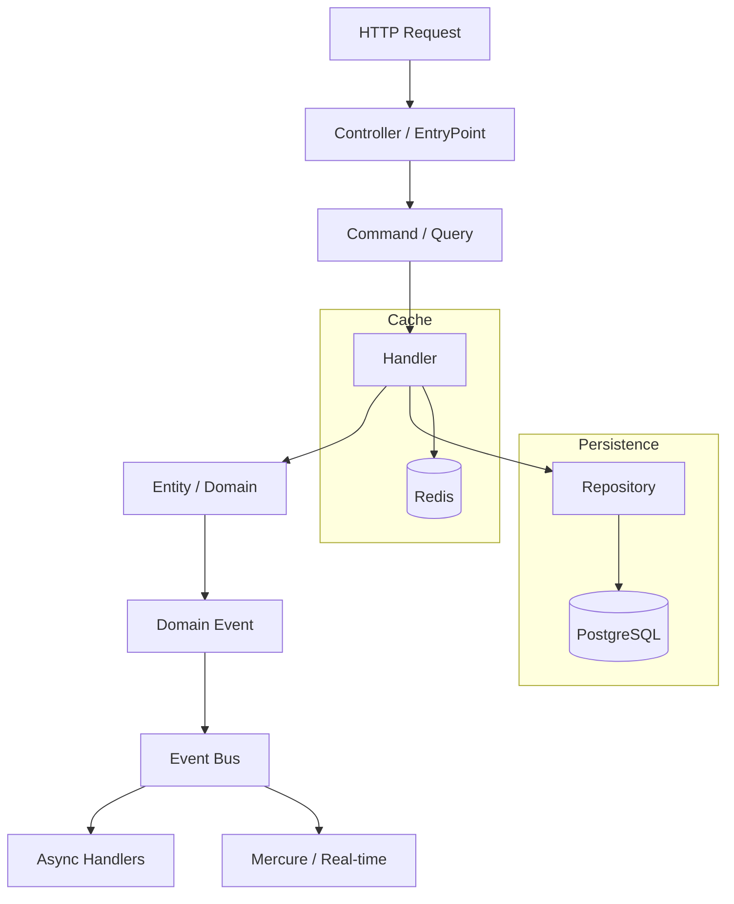

# 🧑‍💻 Pragmatic Franken 

> **Why waste time on repetitive boilerplate?**
> Pragmatic Franken is a unified, production-ready foundation built on Symfony and FrankenPHP. Focus on logic, not configuration.

[](https://www.php.net/releases/8.5/)
[](https://frankenphp.dev/)
[](https://symfony.com/)
[](https://opensource.org/licenses/MIT)
[](https://github.com/k2gl/pragmatic-franken/actions)
[](https://phpstan.org)
[](#)

---

## ⚡️ The "Vibe"

- **One Binary to Rule Them All**: No Nginx, no FPM. Just FrankenPHP.
- **Worker Mode by Default**: Insane performance (boot once, handle thousands of requests).
- **AI-Native**: Pre-configured contexts for Cursor, Windsurf, and Copilot.
- **Pragmatic Architecture**: Vertical Slices instead of messy layers.

---

## 🧑‍🎤 Instant Start

```bash
# 1. Clone and ignite
git clone https://github.com && cd pragmatic-franken

# 2. The Magic Command
make install
```

**Boom!** Your app is live at https://localhost with automatic HTTPS.

---

## 🤓 Pragmatic Stack

| Feature | Tech | Why? |
|---------|------|------|
| Runtime | FrankenPHP | 103 Early Hints, Mercure, and Go-speed. |
| Architecture | [Vertical Slices](docs/adr/0001-vertical-slices.md)  | Features are isolated. High cohesion, low coupling. |
| Database | PostgreSQL 16 | Robust, modern, ready for scale. |
| Async | Messenger + Redis | Built-in CQRS for background heavy lifting. |
| Observability | Prometheus + Grafana | Built-in metrics on port 2019 |

---

## 🦸 AI-First DX (Your New Superpower)

This repo isn't just code; it's Agent-Native. We've optimized the structure so Cursor, Windsurf, or GitHub Copilot understand your project better than you do.
How to summon the magic:

```bash
@AGENTS.md Implement a new 'Subscription' module following our architecture.
```
The AI Agent will:
1. Analyze ADRs: It reads your Architecture Decision Records to keep the code consistent.
2. Scaffold & Code: Creates folders and writes logic according to the project's patterns.
3. Verify: Runs tests to ensure nothing is broken.
4. Deliver: Prepares a PR, ready for your final look.

- **Local Vibe** — Custom tool paths in `.config/agents/agents.local.md`.

---

## 📐 ADR: Architecture Decision Records

We don't do "because I said so". Every decision is documented:

| ADR | Topic | Priority |
|-----|-------|----------|
| [0001](docs/adr/0001-vertical-slices.md) | Vertical Slices Architecture | P0 |
| [0002](docs/adr/0002-messenger-transport.md) | Messenger Transport (CQRS) | P0 |
| [0003](docs/adr/0003-pragmatic-symfony-architecture.md) | Pragmatic Symfony | P0 |
| [0004](docs/adr/0004-frankenphp-runtime.md) | FrankenPHP Runtime | P1 |
| [0005](docs/adr/0005-health-checks.md) | Health Checks | P1 |
| [0006](docs/adr/0006-memory-management.md) | Memory Management | P2 |
| [0007](docs/adr/0007-asset-mapper.md) | AssetMapper | P2 |
| [0008](docs/adr/0008-testing-strategy.md) | Testing Strategy (PHPUnit) | P1 |

---

## ⚖️ Legacy vs Pragmatic

| Layer | Legacy | Pragmatic |
|-------|--------|-----------|
| Web Server | Nginx + FPM | **FrankenPHP** |
| Process Manager | Supervisord | **Worker Mode** |
| Scheduler | Crontab | **Symfony Scheduler** |
| Graceful Shutdown | Manual config | **Out of the box** |

**4 configs = 4 failure points. 1 Caddyfile = 1 source of truth.**

---

## 🍨 The Pragmatic Way

How we write code:

1. Create a Feature Slice
2. Define a Command or Query
3. Handle it

**No over-engineering.**

---

## 📊 Performance

FrankenPHP Worker Mode vs PHP-FPM benchmarks:

| Metric | PHP-FPM | FrankenPHP Worker | Source |
|--------|----------|-------------------|---------|
| Cold Boot | ~150ms | ~10ms | [FrankenPHP](https://frankenphp.dev/docs/benchmarks/) |
| Requests/sec | ~500 | ~8,000 | [TechEmpower](https://www.techempower.com/benchmarks/) |

*[Full benchmarks →](docs/PERFORMANCE.md)*

---

## 🐘 Worker Mode Rules

| Rule | Bad | Good |
|------|-----|------|
| No static cache | `static $cache = []` | `$this->cache->set()` |
| Stateless entities | Entity with static state | Pure entities |
| Clean shutdown | Implicit memory leaks | `register_shutdown_function()` |
| Avoid singletons | `Singleton::getInstance()` | Dependency Injection |

---

## 🔄 Deep Dive



**See [ADR 0002](docs/adr/0002-messenger-transport.md) for Message Bus implementation details.**

---

## 📁 Architecture: Vertical Slices & Modular Monolith 2.0
We don't do "folders by type" (all controllers in one place, all models in another). That's 2010. We group by Business Value.

```
src/
├── Shared/            # Global infrastructure & base classes
│
├── [Module]/          # Bounded Context (e.g., User, Task, Billing)
│   ├── Entity/        # Module-specific Domain Models & Enums
│   ├── Repository/    # Data access interfaces
│   └── Features/        # Vertical Slices (Real work happens here 👇)
│       └── {FeatureName}/
│           ├── {FeatureName}Controller.php     # Entry point (HTTP/CLI)
│           ├── {FeatureName}Handler.php        # Business logic
│           ├── {FeatureName}Command.php        # Data transfer (Request/Response)
│           └── {FeatureName}Test.php           # Local feature test
│
└── Kernel.php         # Symfony MicroKernel
```
Why this kicks ass:
1. Locality of Change: Want to change "User Registration"? Everything is in one folder. No jumping around 10 directories.
2. Zero Side Effects: Delete a folder — the entire feature is gone. No ghost code left behind.
3. AI-Friendly: Your AI Agent finds context instantly. It doesn't have to scan the whole src/Controllers folder to find one specific action.
4. Low Cognitive Load: You focus on the feature, not the framework.

### ⚡️ DX & Scaffolding
Stop wasting time on boilerplate. Use our generators to keep the architecture clean and consistent:

```bash
# Create a new Vertical Slice (Action + Handler + DTO + Test)
make slice module=Billing feature=Subscribe
```
---

## 📚 Guides

- [Development Guide](docs/guides/development.md)
- [Testing Guide](docs/guides/testing.md)
- [Worker Mode Guide](docs/guides/worker-mode.md)
- [AI Agent Setup](docs/guides/agent-setup.md)

---

## 🫵 Contributing

See [Contributing Guidelines](.github/CONTRIBUTING.md) for details.

---

**Build for 2026, not 2015. FrankenPHP is the engine, Symfony is the brain, AI is the hands.**
