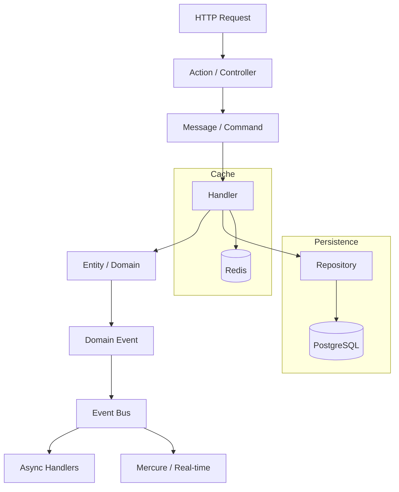

# Pragmatic Franken

[](https://www.php.net/releases/8.5/)
[](https://frankenphp.dev/)
[](https://symfony.com/)
[](https://opensource.org/licenses/MIT)
[](https://github.com/k2gl/pragmatic-franken/actions)

> Symfony project with FrankenPHP, DDD patterns, and Docker infrastructure.

## 🎯 Key Features

- **Modular Architecture** — DDD patterns with clear module boundaries
- **AI-Ready** — AGENTS.md for AI assistant configuration
- **Developer Experience** — `make up` for quick start

## 🛠 Technologies

- **PHP 8.5 (Alpine)**: Latest features (Pipe operator, URI extension).
- **FrankenPHP**: Go-based application server with Worker Mode support.
- **PostgreSQL 16**: Primary database.
- **Redis 7**: Cache, sessions, and Messenger.
- **Caddy**: Automatic HTTPS and HTTP/3.

## 📊 FrankenPHP Features

- Worker Mode for long-running processes without separate queues
- 103 Early Hints for resource preloading
- Built-in Mercure for real-time updates
- Prometheus metrics on port 2019

See [ADR 0005: FrankenPHP Application Server](docs/adr/0005-frankenphp-server.md) for details.

## 🚀 Quick Start

1. **Start the project:**
   ```bash
   make up
   ```

2. **Install dependencies:**
   ```bash
   make install
   ```

3. **Run migrations:**
   ```bash
   make db-migrate
   ```

Project will be available at: https://localhost (or http://localhost).

## 🤖 AI Agent Integration

This project is optimized for AI assistants (Cursor, Windsurf, GitHub Copilot).

### Local Environment Setup

For the agent to know paths to your local tools (Git CLI, Python, etc.) and follow your personal preferences:

1. Navigate to `.config/agents/` directory.
2. Copy `agents.local.md.example` as `agents.local.md`.
3. Make your edits (this file is in `.gitignore` and won't be committed).

### Configuration Structure

- `AGENTS.md` (root) — entry point for AI.
- `.config/agents/agents.md` — project rules and code standards.
- `.config/agents/agents.local.md` — your personal settings and tool paths.

## 📁 Project Structure

```
pragmatic-franken/
├── src/
│   ├── Kernel.php              # Symfony MicroKernel
│   ├── User/                   # Module (Bounded Context)
│   │   ├── Features/          # Vertical Slices
│   │   │   ├── RegisterUser/
│   │   │   │   ├── RegisterUserAction.php       # Controller
│   │   │   │   ├── RegisterUserMessage.php      # DTO
│   │   │   │   ├── RegisterUserHandler.php       # Business Logic
│   │   │   │   └── RegisterUserResponse.php      # Response
│   │   │   └── Events/
│   │   │       └── UserRegisteredEvent.php       # Domain Event
│   │   ├── Entity/
│   │   │   └── User.php
│   │   └── Repository/
│   └── Shared/                 # Cross-module Shared Kernel
│       ├── Messaging/          # Messenger config
│       └── EventBus.php
├── config/                     # Symfony configuration
├── docker/
│   ├── frankenphp/            # FrankenPHP config + Caddyfile
│   ├── php/                   # PHP extensions
│   └── ...
├── docs/                       # Architecture decisions (ADRs) and guides
│   ├── adr/                    # Architectural Decision Records
│   ├── architecture/           # Architecture documentation
│   └── guides/                 # Development guides
├── tests/                      # PHPUnit tests
├── .github/
│   ├── workflows/             # CI/CD pipelines
│   └── CONTRIBUTING.md        # Contribution guidelines
├── Caddyfile                  # FrankenPHP server config (symlinked)
├── docker-compose.yml
├── Makefile
├── AGENTS.md                  # AI Agent entry point
└── .config/agents/            # AI Agent configurations
```

## 🔄 Application Flow



## 🏗 Docker Architecture

Multi-stage build is used:
- **php_base**: Base layer with extensions (intl, bcmath, pdo_pgsql, apcu).
- **php_dev**: Development layer (Xdebug, dev dependencies).
- **php_prod**: Optimized layer for production (Worker Mode, Preload, AssetMapper).

## 🛡 CI/CD Pipeline

On each push to main, GitHub Actions performs:

1. **Gitleaks**: Search for secrets in code.
2. **Composer Audit**: Check for vulnerabilities in PHP packages.
3. **Trivy**: Scan image for system vulnerabilities.
4. **PHPStan**: Static analysis (Level 8).
5. **PHP-CS-Fixer**: Code style enforcement.
6. **PHPUnit**: Run tests.

## 📊 Monitoring and Metrics

- **Prometheus**: Collects FrankenPHP metrics on port 2019.
- **Grafana**: Visualization (port 3000).
- **Healthcheck**: Container automatically restarts if /healthz endpoint is unavailable.

## ⏰ Scheduler (Cron)

Tasks are executed via Symfony Scheduler inside the main FrankenPHP container. Process management is handled via exec in Caddyfile.

## 🐞 Debugging (Xdebug)

- Xdebug configured on port 9003.
- Host: host.docker.internal
- IDE Key: PHPSTORM or VS Code "PHP Debug" extension.

## 📚 Documentation

### Architecture Decisions (ADRs)

All major architectural decisions are documented as ADRs in [`docs/adr/`](docs/adr/):

- [ADR 0001: Pragmatic Symfony Architecture](docs/adr/0001-pragmatic-symfony-architecture.md) — Core principles and compliance checklist
- [ADR 0002: Symfony Messenger as Main Bus](docs/adr/0002-messenger-as-main-bus.md) — Command/Query separation
- [ADR 0003: Transactional Outbox Pattern](docs/adr/0003-transactional-outbox-pattern.md) — Guaranteed event delivery
- [ADR 0004: Modular Monolith Architecture](docs/adr/0004-modular-monolith-architecture.md) — Module boundaries
- [ADR 0005: FrankenPHP Application Server](docs/adr/0005-frankenphp-server.md) — Server selection

See [Architecture Overview](docs/ARCHITECTURE.md) for implementation details.

### Guides

- [Development Guide](./docs/guides/development.md) — Quick start and daily commands
- [Testing Guide](./docs/guides/testing.md) — Unit, Integration, E2E strategies
- [AI Agent Setup](./docs/guides/agent-setup.md) — Configure Cursor, Windsurf, Copilot
- [Local Agent Config](./docs/guides/agents-local-config.md) — Personal preferences for AI
- [AI Automation](./docs/guides/ai-automation.md) — Free AI tools for repository maintenance

### Contribution

- [Contributing Guidelines](./.github/CONTRIBUTING.md) — How to contribute

## 🔧 Automation & AI Tools

The project is configured with:

- **Conventional Commits**: Automatic PR validation
- **Dependabot**: Auto-update dependencies
- **CodiumAI**: Free PR reviews (setup required)

See [AI Automation Guide](./docs/guides/ai-automation.md) for setup instructions.
