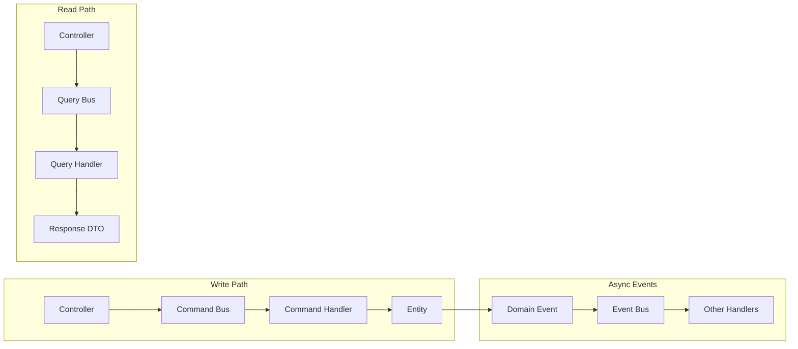

# ADR 0002: Symfony Messenger as Main Bus

**Date:** 2026-02-04  
**Status:** Accepted  
**Owner:** Architecture Team

## Context

We needed a way to:
1. Separate UI (Controllers) from business logic
2. Enable loose coupling between modules
3. Support both synchronous and asynchronous operations
4. Provide a clean path to microservices in the future

Traditional approach of calling services directly from controllers creates tight coupling and makes testing harder.

## Decision

We use **Symfony Messenger** as the main communication bus implementing CQRS patterns:

- **Commands** for write operations (synchronous)
- **Queries** for read operations (synchronous)
- **Events** for cross-module communication (asynchronous by default)

### Command-Query Responsibility Segregation



## Implementation

### 1. Command Bus

**Purpose:** Handle write operations (state changes)

**Naming:** `*Command` for messages, `*Handler` for handlers

```php
// Application/Command/RegisterUserCommand.php
declare(strict_types=1);

namespace App\User\Application\Command;

final readonly class RegisterUserCommand
{
    public function __construct(
        public string $email,
        public string $password,
        public string $name
    ) {}
}
```

```php
// Application/Handler/RegisterUserHandler.php
declare(strict_types=1);

namespace App\User\Application\Handler;

use App\User\Application\Command\RegisterUserCommand;
use App\User\Application\Dto\UserResponse;
use App\User\Domain\UserRepository;
use Symfony\Component\Messenger\Attribute\AsMessageHandler;

#[AsMessageHandler]
final readonly class RegisterUserHandler
{
    public function __construct(private UserRepository $repository) {}

    public function handle(RegisterUserCommand $command): UserResponse
    {
        $user = User::register(
            $command->email,
            $command->password,
            $command->name
        );
        
        $this->repository->save($user);
        
        return UserResponse::fromEntity($user);
    }
}
```

### 2. Query Bus

**Purpose:** Handle read operations (data retrieval)

**Naming:** `*Query` for messages, `*Handler` for handlers

```php
// Application/Query/GetUserQuery.php
declare(strict_types=1);

namespace App\User\Application\Query;

final readonly class GetUserQuery
{
    public function __construct(public int $userId) {}
}
```

```php
// Application/Handler/GetUserHandler.php
declare(strict_types=1);

namespace App\User\Application\Handler;

use App\User\Application\Query\GetUserQuery;
use App\User\Application\Dto\UserResponse;
use App\User\Infrastructure\UserReadRepository;
use Symfony\Component\Messenger\Attribute\AsMessageHandler;

#[AsMessageHandler]
final readonly class GetUserHandler
{
    public function __construct(private UserReadRepository $repository) {}

    public function handle(GetUserQuery $query): UserResponse
    {
        return $this->repository->findById($query->userId);
    }
}
```

### 3. Event Bus

**Purpose:** Notify other modules of domain changes

**Naming:** `*Event` for messages, `*Handler` for handlers

```php
// Domain/Event/UserRegisteredEvent.php
declare(strict_types=1);

namespace App\User\Domain\Event;

use App\Shared\Domain\Event\AbstractDomainEvent;

final class UserRegisteredEvent extends AbstractDomainEvent
{
    public function __construct(
        public readonly int $userId,
        public readonly string $email
    ) {}
}
```

```php
// Application/Handler/SendWelcomeEmailHandler.php
declare(strict_types=1);

namespace App\User\Application\Handler;

use App\User\Domain\Event\UserRegisteredEvent;
use App\Shared\Infrastructure\Email\EmailSender;
use Symfony\Component\Messenger\Attribute\AsMessageHandler;

#[AsMessageHandler]
final readonly class SendWelcomeEmailHandler
{
    public function __construct(private EmailSender $sender) {}

    public function handle(UserRegisteredEvent $event): void
    {
        $this->sender->sendWelcomeEmail($event->email);
    }
}
```

### Messenger Configuration

```yaml
# config/packages/messenger.yaml
framework:
    messenger:
        buses:
            command.bus:
                middleware:
                    - doctrine_transaction
                    - validate
            
            query.bus:
                middleware:
                    - validate
            
            event.bus:
                default_bus: event.bus
                middleware:
                    - doctrine_transaction
                    - validation

        transports:
            async:
                dsn: '%env(MESSENGER_TRANSPORT_DSN)%'
                serializer: 'App\Shared\Infrastructure\Messenger\NativeEventSerializer'

        routing:
            'App\*\Domain\Event\*': async
            'App\Shared\Application\Command\*': command.bus
            'App\Shared\Application\Query\*': query.bus
```

## Consequences

### Positive

1. **Separation of Concerns**: Controllers don't contain business logic
2. **Testability**: Handlers are easy to unit test in isolation
3. **Flexibility**: Easy to change handler implementation without touching UI
4. **Scalability**: Async events enable eventual consistency patterns
5. **Audit Trail**: Commands provide clear intent for every state change
6. **Microservices Ready**: Commands/events are natural fit for distributed systems

### Negative

1. **More Classes**: Each operation needs Command + Handler (+ DTOs)
2. **Learning Curve**: Team must understand Messenger patterns
3. **Debugging**: Stack traces span multiple classes
4. **Performance**: Small overhead from bus middleware

## Alternatives Considered

1. **Direct Service Calls**: Simpler but creates coupling, hard to test
2. **Laravel-style Events**: Less structured, harder to enforce patterns
3. **Event Sourcing**: Overkill for most applications

## Guidelines

### When to Use Commands vs Queries

| Scenario | Bus | Example |
|----------|-----|---------|
| Create/Update/Delete state | Command Bus | `CreateOrderCommand` |
| Trigger side effects | Command Bus | `SendEmailCommand` |
| Retrieve data only | Query Bus | `GetOrderDetailsQuery` |
| Notify other modules | Event Bus | `OrderCreatedEvent` |

### Handler Best Practices

1. **One handler per message**: Keep handlers focused
2. **No return for commands**: Changes happen inside entities
3. **Return DTOs for queries**: Never return entities
4. **Use transaction middleware**: Ensure atomicity for commands
5. **Validate early**: Validate DTOs before reaching handlers

## References

- [Symfony Messenger Documentation](https://symfony.com/doc/current/messenger.html)
- [CQRS by Martin Fowler](https://martinfowler.com/bliki/CQRS.html)
- [Gregory Young on Commands and Events](https://www.youtube.com/watch?v=JINCbgxvy3U)
