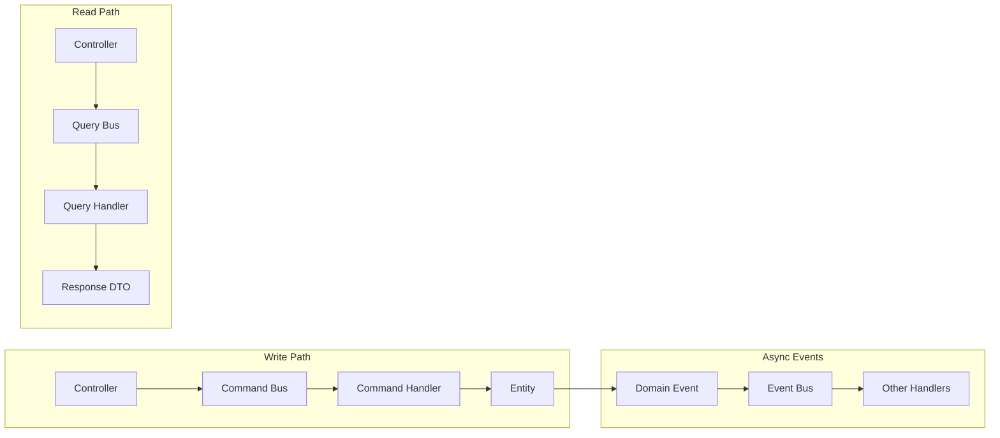

# ADR 004: Messenger Transport

**Date:** 2026-02-04
**Status:** Accepted
**Owner:** Architecture Team

## Context

We needed a way to:
1. Separate UI (Controllers) from business logic
2. Enable loose coupling between modules
3. Support both synchronous and asynchronous operations
4. Provide a clean path to microservices in the future

Traditional approach of calling services directly from controllers creates tight coupling and makes testing harder.

## Decision

We use **Symfony Messenger** as the main communication bus implementing CQRS patterns:

- **Commands** for write operations (synchronous)
- **Queries** for read operations (synchronous)
- **Events** for cross-module communication (asynchronous by default)

See [ADR 001: Pragmatic Symfony Architecture](adr-001-pragmatic-symfony-architecture.md) for the Message Bus Rule and compliance requirements.

## Command-Query Responsibility Segregation



## Implementation

### 1. Command Bus

**Purpose:** Handle write operations (state changes)

**Naming:** `*Message` for messages, `*Handler` for handlers

```php
// Features/CreateTask/CreateTaskMessage.php
declare(strict_types=1);

namespace App\Task\Features\CreateTask;

final readonly class CreateTaskMessage
{
    public function __construct(
        public string $title,
        public int $columnId,
        public ?string $description = null,
    ) {}
}
```

```php
// Features/CreateTask/CreateTaskHandler.php
declare(strict_types=1);

namespace App\Task\Features\CreateTask;

use Symfony\Component\Messenger\Attribute\AsMessageHandler;

#[AsMessageHandler]
final readonly class CreateTaskHandler
{
    public function __construct(
        private TaskRepository $repository,
    ) {}

    public function handle(CreateTaskMessage $message): CreateTaskResponse
    {
        // Business logic here
    }
}
```

### 2. Query Bus

**Purpose:** Handle read operations (data retrieval)

```php
// Features/GetTask/GetTaskQuery.php
declare(strict_types=1);

namespace App\Task\Features\GetTask;

final readonly class GetTaskQuery
{
    public function __construct(public int $taskId) {}
}
```

### 3. Event Bus

**Purpose:** Notify other modules of domain changes

```php
// Domain/Event/TaskCompletedEvent.php
declare(strict_types=1);

namespace App\Task\Domain\Event;

use App\Shared\Domain\Event\AbstractDomainEvent;

final class TaskCompletedEvent extends AbstractDomainEvent
{
    public function __construct(
        public readonly int $taskId,
        public readonly int $userId,
    ) {}
}
```

## AI Use Cases

Messenger is particularly useful for AI workloads:

### 1. Async LLM Processing

```php
// Command for AI processing
final readonly class GenerateSummaryCommand
{
    public function __construct(
        public int $taskId,
        public string $content,
        public string $model = 'gpt-4',
    ) {}
}

// Handler processes asynchronously
#[AsMessageHandler]
final readonly class GenerateSummaryHandler
{
    public function __construct(
        private LlmService $llm,
        private TaskRepository $repository,
    ) {}

    public function handle(GenerateSummaryCommand $command): void
    {
        $summary = $this->llm->generate($command->content, $command->model);
        // Store result, notify user
    }
}
```

### 2. Streaming Responses

For real-time AI streaming, use FrankenPHP streaming with Messenger as bridge:

```php
// Controller initiates async job
public function __invoke(
    #[MapRequestPayload] GenerateSummaryMessage $message,
    MessageBusInterface $bus,
): Response {
    $jobId = uniqid('job_');
    
    // Dispatch async job
    $bus->dispatch(new GenerateSummaryJob(
        jobId: $jobId,
        content: $message->content,
    ));
    
    // Return immediately with job ID
    return $this->json(['jobId' => $jobId]);
}
```

### 3. Rate Limiting via Transport

```yaml
framework:
    messenger:
        transports:
            ai:
                dsn: 'redis://localhost/ai'
                options:
                    max_pending: 100
```

## Consequences

### Positive

1. **Separation of Concerns**: Controllers don't contain business logic
2. **Testability**: Handlers are easy to unit test in isolation
3. **Flexibility**: Easy to change handler implementation without touching UI
4. **Scalability**: Async events enable eventual consistency patterns
5. **Audit Trail**: Commands provide clear intent for every state change
6. **Microservices Ready**: Commands/events are natural fit for distributed systems

### Negative

1. **More Classes**: Each operation needs Message + Handler (+ DTOs)
2. **Learning Curve**: Team must understand Messenger patterns
3. **Debugging**: Stack traces span multiple classes
4. **Performance**: Small overhead from bus middleware

## Guidelines

### When to Use Commands vs Queries

| Scenario | Bus | Example |
|----------|-----|---------|
| Create/Update/Delete state | Command Bus | `CreateTaskMessage` |
| Trigger side effects | Command Bus | `SendNotificationMessage` |
| Retrieve data only | Query Bus | `GetTaskQuery` |
| Notify other modules | Event Bus | `TaskCompletedEvent` |

### Handler Best Practices

1. **One handler per message**: Keep handlers focused
2. **No return for commands**: Changes happen inside entities
3. **Return DTOs for queries**: Never return entities
4. **Use transaction middleware**: Ensure atomicity for commands
5. **Validate early**: Validate DTOs before reaching handlers

## References

- [Symfony Messenger Documentation](https://symfony.com/doc/current/messenger.html)
- [CQRS by Martin Fowler](https://martinfowler.com/bliki/CQRS.html)
- [Gregory Young on Commands and Events](https://www.youtube.com/watch?v=JINCbgxvy3U)
