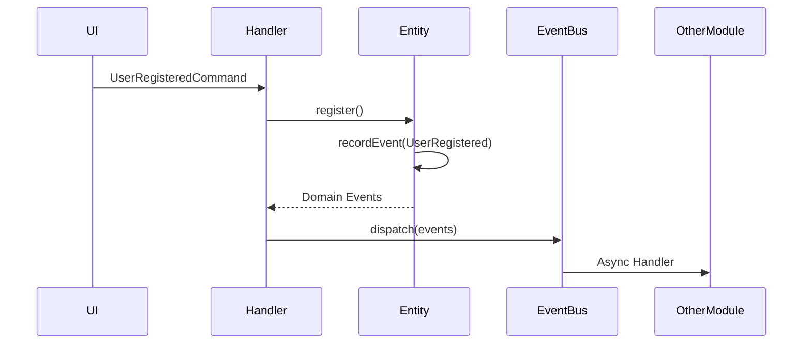

# Module Interaction

## Overview

This project follows a Modular Monolith architecture. Modules are **bounded contexts** with clear boundaries and explicit interfaces for communication.

## Module Structure

```
src/
├── User/                      # Module (Bounded Context)
│   ├── Domain/
│   │   ├── Entity/
│   │   ├── ValueObject/
│   │   ├── Event/
│   │   └── Repository/
│   ├── Application/
│   │   ├── Command/
│   │   ├── Query/
│   │   └── Handler/
│   ├── Infrastructure/
│   │   ├── Doctrine/
│   │   └── External/
│   └── UI/
│       ├── Http/
│       └── Cli/
├── Order/                     # Another Module
│   └── ...
└── Shared/                    # Shared Kernel
    ├── Domain/
    ├── Application/
    └── Infrastructure/
```

## Golden Rules

### 1. No Cross-Module Entity References

**BAD:**
```php
// User/Domain/Entity/User.php
class User
{
    private Order $lastOrder; // VIOLATION!
}
```

**GOOD:**
```php
// User/Domain/Entity/User.php
class User
{
    public function lastOrderId(): int { /* ... */ }
}
```

### 2. Communication via Events

Modules communicate asynchronously via Domain Events:

```php
// User/Domain/Event/UserRegisteredEvent.php
declare(strict_types=1);

namespace App\User\Domain\Event;

use App\Shared\Domain\Event\AbstractDomainEvent;

final class UserRegisteredEvent extends AbstractDomainEvent
{
    public function __construct(
        public readonly int $userId,
        public readonly string $email
    ) {}
}
```

```php
// Order/Application/Handler/CreateWelcomeOrderHandler.php
declare(strict_types=1);

namespace App\Order\Application\Handler;

use App\User\Domain\Event\UserRegisteredEvent;
use App\Order\Application\Command\CreateOrderCommand;
use Symfony\Component\Messenger\Attribute\AsMessageHandler;

#[AsMessageHandler]
final readonly class CreateWelcomeOrderHandler
{
    public function handle(UserRegisteredEvent $event): void
    {
        $command = new CreateOrderCommand($event->userId);
        $this->dispatch($command);
    }
}
```

### 3. Shared Kernel for Cross-Cutting Concerns

Only explicitly shared code goes to `Shared/`:

**Allowed in Shared:**
- Base exceptions
- Value objects used everywhere (Email, Uuid)
- Base classes (AbstractAggregateRoot, AbstractDomainEvent)
- Interfaces for infrastructure (LoggerInterface, CacheInterface)

**NOT allowed in Shared:**
- Business logic specific to one module
- Module-specific entities
- Feature flags for one module

## Event-Driven Architecture

### Event Flow



### Outbox Pattern for Reliability

Events are stored in an outbox table and dispatched reliably:

```php
// Doctrine listener automatically dispatches after flush
final readonly class DomainEventDispatcher
{
    public function postFlush(): void
    {
        $events = $this->outboxRepository->findUndispatched();
        foreach ($events as $event) {
            $this->messageBus->dispatch($event);
            $event->markDispatched();
        }
    }
}
```

## Contract Interfaces for Synchronous Communication

When synchronous communication is needed, use contracts:

```php
// Shared/Application/Contract/UserLookupInterface.php
declare(strict_types=1);

namespace App\Shared\Application\Contract;

interface UserLookupInterface
{
    public function findById(int $id): ?UserData;
    public function existsByEmail(string $email): bool;
}
```

```php
// User/Infrastructure/Repository/UserLookupRepository.php
declare(strict_types=1);

namespace App\User\Infrastructure\Repository;

use App\Shared\Application\Contract\UserLookupInterface;

// User module provides implementation
final readonly class UserLookupRepository implements UserLookupInterface
{
    // ...
}
```

## When to Extract a Module

Consider extracting to a separate repository when:

1. **Different scaling needs** - CPU-heavy vs I/O-heavy
2. **Different technology** - Needs different database, framework
3. **Different team ownership** - Separate deployment cycle
4. **Different security requirements** - Different compliance needs

## Module Checklist

- [ ] Module has its own bounded context
- [ ] No direct entity references from other modules
- [ ] Communication via Events or Contracts only
- [ ] Events are in Domain layer
- [ ] Handlers are in Application layer
- [ ] Infrastructure is separated from Domain/Application
- [ ] Tests verify module boundaries
